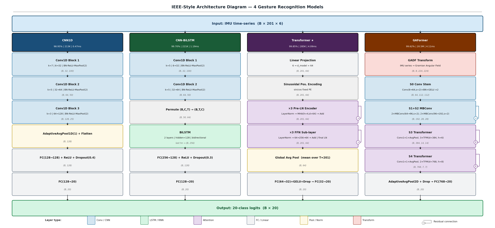
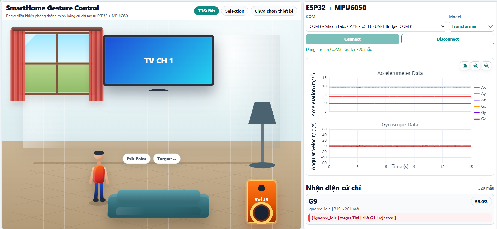
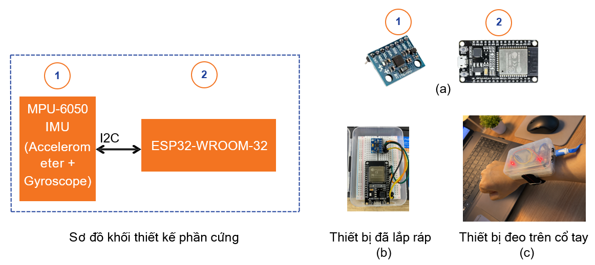
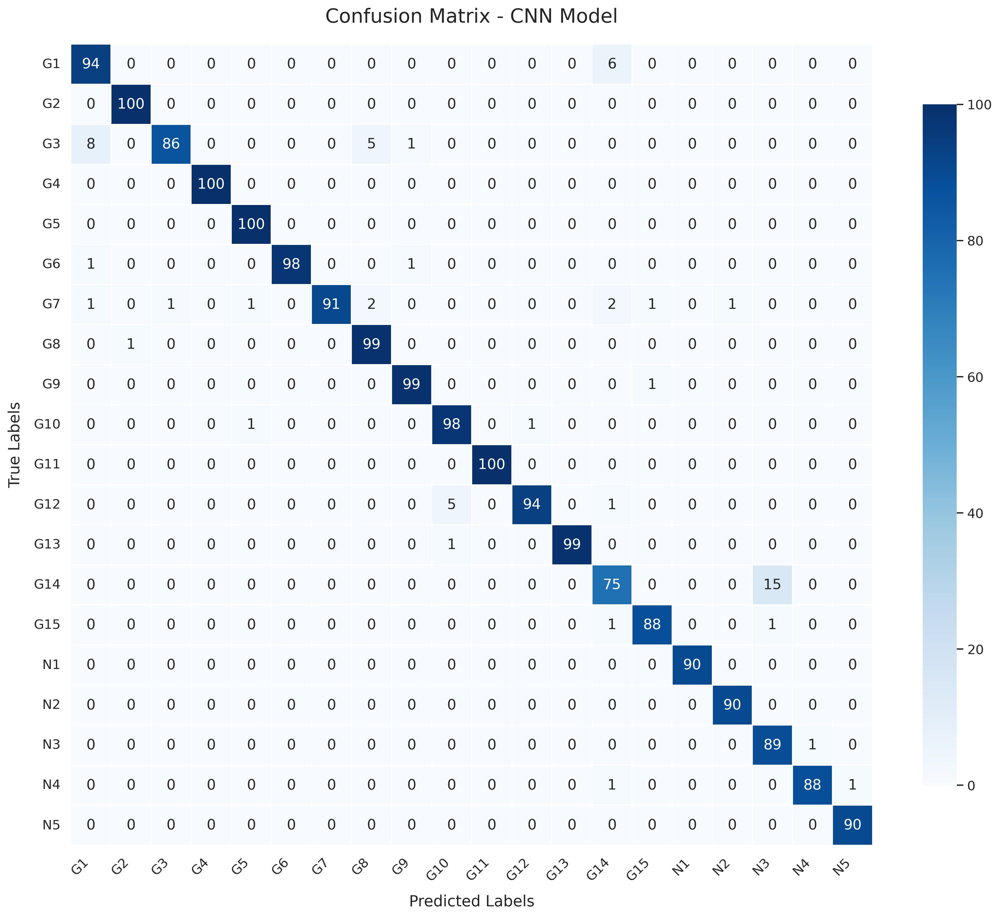
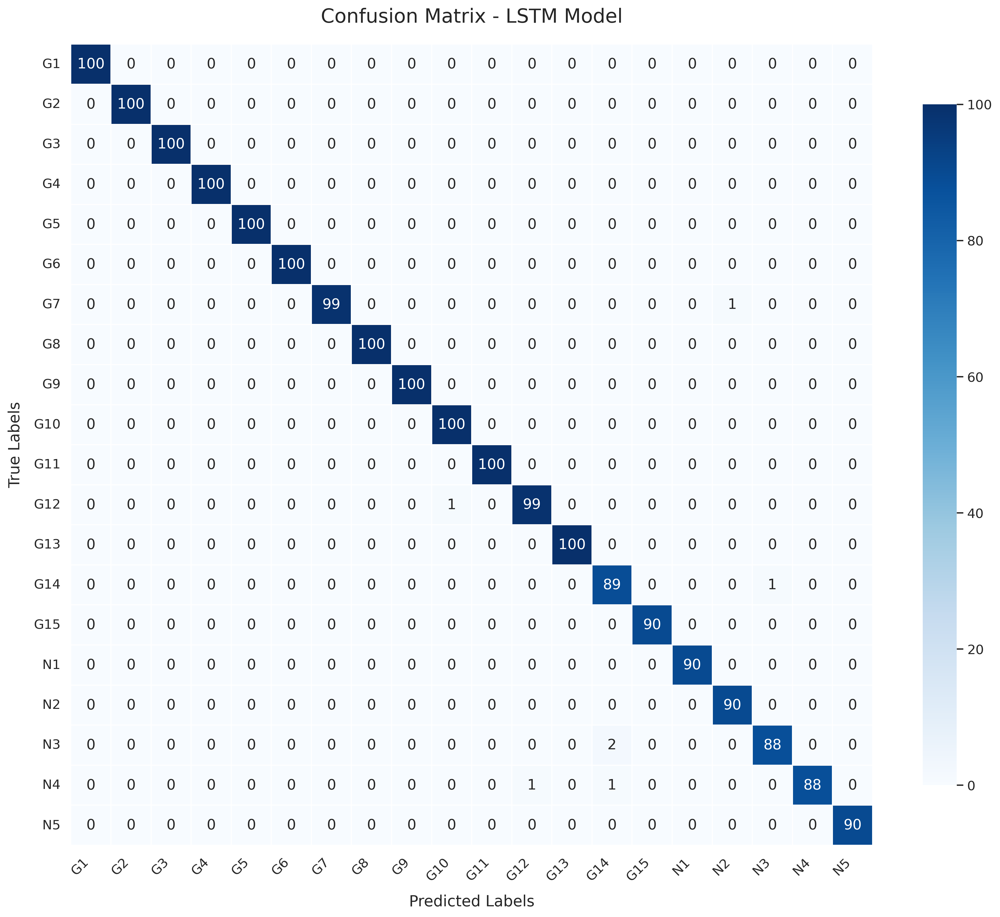
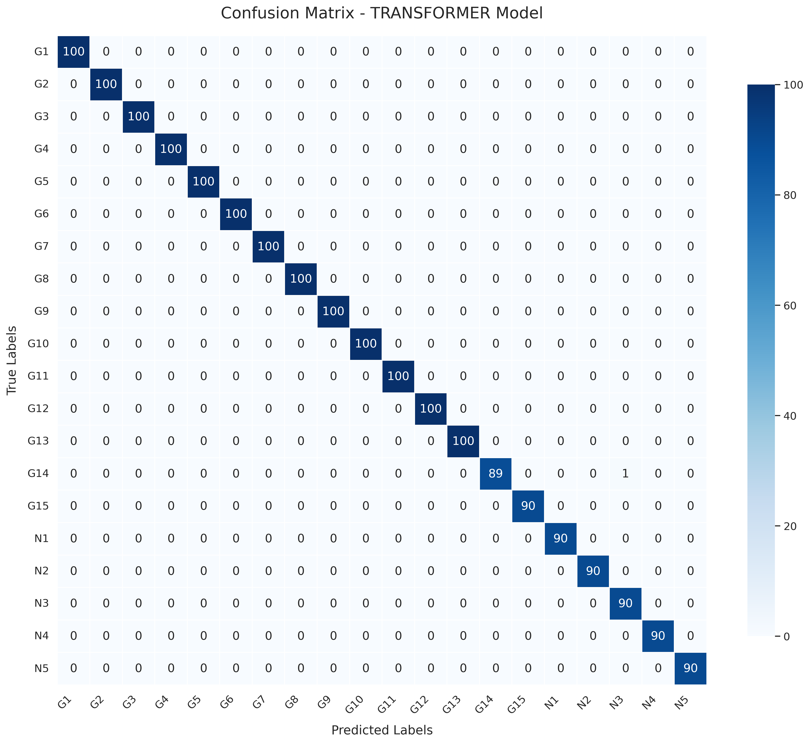
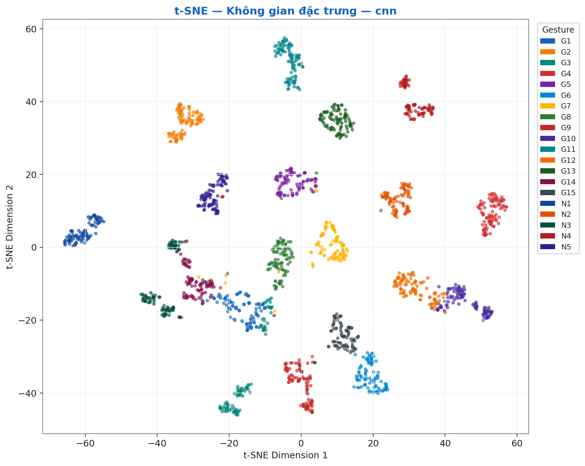
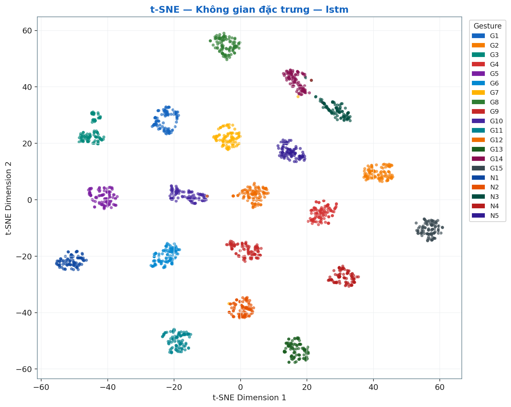
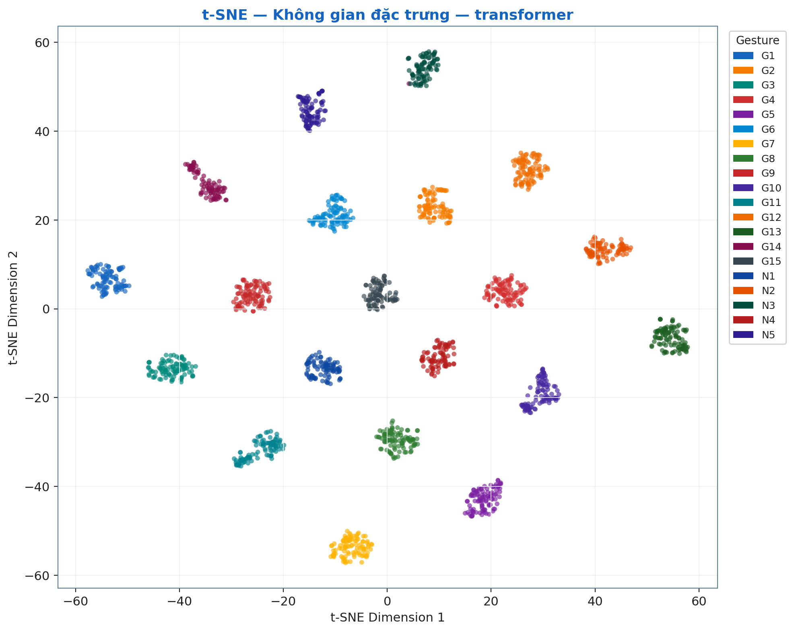

# Hand Gesture Recognition for Smart Home Control
### Using Wrist-Worn IMU Sensor (MPU6050 + ESP32)

> **Đồ án tốt nghiệp** — Trường Đại học Đại Nam  
> Sinh viên: **Phạm Thị Hồng Ngọc** (MSV: 1671020226)  
> GVHD: *(Tên giảng viên hướng dẫn)*

---

## Tổng quan hệ thống

Hệ thống nhận dạng **15 cử chỉ tay** (G1–G15) và **5 chuyển động nhiễu** (N1–N5) từ cảm biến IMU đeo cổ tay, điều khiển thiết bị nhà thông minh theo thời gian thực.

```
Cảm biến IMU  ──►  Tiền xử lý  ──►  Mô hình DL  ──►  Điều khiển Smart Home
(MPU6050+ESP32)    (50Hz, 4s)       (20 lớp)        (TV / Loa / Đèn / Rèm)
```

---

## Bộ dữ liệu — SHG_Dataset

| Thông số | Giá trị |
|---|---|
| Tổng số mẫu | 10,644 trials |
| Số người tham gia | 15 subjects (S01–S15) |
| Nhãn cử chỉ | 15 gestures (G1–G15) |
| Nhãn nhiễu | 5 noise actions (N1–N5) |
| Tần số mẫu | 50 Hz (resample từ ~100 Hz) |
| Độ dài mỗi mẫu | 4 giây = 201 timesteps |
| Kích thước input | (201, 6) — 3 trục gia tốc + 3 trục con quay |
| Tập huấn luyện | 7,882 (S01–S11) |
| Tập kiểm tra | 1,432 (S12–S13) / 1,330 (S14–S15) |

**Danh sách cử chỉ:**

| Ký hiệu | Mô tả | Ký hiệu | Mô tả |
|---|---|---|---|
| G1 | START — Nắm tay | G9 | Giảm âm lượng (V xuống) |
| G2 | SELECT — Xoay cổ tay | G10 | Bật đèn (vòng tròn CCW) |
| G3 | Kênh yêu thích TV | G11 | Tắt đèn (vòng tròn CW) |
| G4 | Đổi nguồn TV | G12 | Đóng rèm (cung phải) |
| G5 | Kênh tiếp theo | G13 | Mở rèm (cung trái) |
| G6 | Kênh trước đó | G14 | STOP — Lòng bàn tay mở |
| G7 | Tìm kiếm giọng nói (S) | G15 | RESET — Hình chữ Z |
| G8 | Tăng âm lượng (V lên) | N1–N5 | Đi bộ / Xem đồng hồ / Gõ phím / Uống nước / Gãi đầu |

---

## Kiến trúc các mô hình



### Kết quả so sánh (Test set: S14–S15)

| Mô hình | Accuracy | F1-score | Params | Inference |
|---|---|---|---|---|
| CNN1D | 96.79% | 96.75% | 56K | 1.21 ms |
| CNN-BiLSTM | 99.64% | 99.62% | 641K | 3.35 ms |
| **Transformer** ★ | **99.95%** | **99.94%** | 153K | 2.67 ms |
| GAFormer | 99.62% | 99.64% | 20.5M | 4.11 ms |
| Random Forest | 100% | 100% | — | — |

> ★ **Transformer** được chọn cho hệ thống demo — cân bằng tốt nhất giữa độ chính xác, tốc độ và kích thước mô hình.

---

## Cấu trúc dự án

```
Do_an/
├── data_collection/          # Thu thập dữ liệu từ cảm biến
│   ├── collector/
│   │   └── collect_serial.py # Đọc serial từ ESP32
│   ├── streamlit_app.py      # Giao diện thu thập dữ liệu
│   └── resample_to_50hz.py   # Resample về 50 Hz
│
├── train_4_model/            # Huấn luyện CNN1D, CNN-BiLSTM, Transformer
│   ├── training/
│   │   ├── models.py         # Định nghĩa 3 mô hình DL
│   │   ├── dataset.py        # SHGDataset + DataLoader
│   │   ├── augmentation.py   # Jitter/Scale/TimeWarp/MagnitudeWarp/ChannelDropout
│   │   ├── trainer.py        # Vòng lặp huấn luyện + Early Stopping
│   │   ├── models_rf.py      # Random Forest (Late Fusion)
│   │   └── features.py       # Trích xuất đặc trưng thống kê
│   ├── demo_models/          # Các model đã train (*.pt)
│   └── figures/              # Biểu đồ kết quả huấn luyện
│
├── gaformer/                 # GAFormer — GADF + CoAtNet-light
│   └── src/
│       ├── model.py          # GAFormer architecture
│       ├── gadf.py           # Gramian Angular Difference Field transform
│       ├── train.py          # Training script
│       ├── baselines.py      # GASF/GADF + ResNet50/CoAtNet-0 baselines
│       └── dataset.py        # Dataset cho GAFormer
│
├── demo/                     # Demo điều khiển Smart Home
│   ├── backend/
│   │   └── app.py            # FastAPI + WebSocket server
│   └── predict.py            # Inference pipeline + FSM
│
├── scripts/                  # Utility scripts
│   ├── train_dl.py           # Train tất cả DL models
│   ├── train_rf_latefusion.py# Train ML models
│   ├── evaluate.py           # Đánh giá tổng hợp
│   ├── preprocess.py         # Tiền xử lý dataset
│   └── export_best.py        # Export model tốt nhất
│
├── visualization/            # Công cụ vẽ biểu đồ
├── images/                   # Hình ảnh, sơ đồ kiến trúc
├── config.yaml               # Cấu hình toàn hệ thống
├── requirements_training.txt # Dependencies
└── colab_training.ipynb      # Notebook training trên Google Colab
```

---

## Cài đặt

### Yêu cầu

- Python 3.10+
- PyTorch 2.x
- CUDA (tùy chọn, để tăng tốc training)

### Cài đặt dependencies

```bash
git clone https://github.com/phamthihongngoc/Do_an_tot_nghiep.git
cd Do_an_tot_nghiep

python -m venv .venv
.venv\Scripts\activate          # Windows
# source .venv/bin/activate     # Linux/Mac

pip install -r requirements_training.txt
```

---

## Sử dụng

### 0. Tải bộ dữ liệu SHG_Dataset

> Dataset (~163 MB) không được lưu trực tiếp trên GitHub do giới hạn dung lượng.  
> Tải về tại: **[Google Drive — SHG_Dataset.zip](https://drive.google.com/)**  
> Giải nén vào thư mục: `data_collection/data/SHG_Dataset/`

```
data_collection/data/
└── SHG_Dataset/
    ├── S01/  G1/ G2/ ... G15/ N1/ ... N5/
    ├── S02/
    ...
    └── S15/
```

### 1. Thu thập dữ liệu

```bash
# Chạy giao diện thu thập dữ liệu (Streamlit)
streamlit run data_collection/streamlit_app.py
```

Kết nối ESP32 qua cổng COM, chọn cử chỉ và ghi dữ liệu. Dữ liệu raw lưu dưới dạng CSV.

```bash
# Resample dữ liệu về 50 Hz
python data_collection/resample_to_50hz.py
```

### 2. Huấn luyện mô hình

```bash
# Train CNN1D, CNN-BiLSTM, Transformer
python scripts/train_dl.py --config config.yaml

# Train Random Forest, SVM, XGBoost
python scripts/train_rf_latefusion.py --config config.yaml

# Train GAFormer
python gaformer/src/train.py
```

**Hoặc dùng Google Colab:**
Mở `colab_training.ipynb` trên [Google Colab](https://colab.research.google.com/).

### 3. Đánh giá

```bash
python scripts/evaluate.py --model transformer --checkpoint train_4_model/demo_models/transformer_20260525_202104/best.pt
```

### 4. Chạy Demo Smart Home

```bash
# Backend FastAPI
python demo/backend/app.py

# Mở trình duyệt: http://localhost:8000
```

Kết nối ESP32, thực hiện cử chỉ → hệ thống nhận dạng real-time và điều khiển thiết bị mô phỏng.



---

## Finite State Machine (FSM)

Hệ thống sử dụng FSM 4 trạng thái để điều khiển luồng nhận dạng:

```
IDLE ──(G1)──► ACTIVE ──(G14)──► STOP_PENDING ──(timeout 6s)──► IDLE
                  │                                    │
                  └──(G15 RESET)──► EMERGENCY ─────────┘
```

| Trạng thái | Mô tả |
|---|---|
| IDLE | Chờ cử chỉ kích hoạt G1 (nắm tay) |
| ACTIVE | Nhận dạng và điều khiển thiết bị |
| STOP_PENDING | Nhận G14, chờ xác nhận dừng |
| EMERGENCY | G15 RESET, khởi động lại hệ thống |

---

## Phần cứng



| Thành phần | Mô tả |
|---|---|
| **MPU6050** | Cảm biến IMU 6 trục (3-axis accel + 3-axis gyro) |
| **ESP32-WROOM-32** | Vi điều khiển WiFi/BT, đọc I2C từ MPU6050 |
| Giao tiếp | I2C (SDA/SCL), tần số ~100 Hz → resample 50 Hz |

---

## Tăng cường dữ liệu

| Kỹ thuật | Mô tả |
|---|---|
| **Jitter** | Thêm nhiễu Gaussian ngẫu nhiên |
| **Scale** | Nhân biên độ với hệ số ngẫu nhiên |
| **TimeWarp** | Co/giãn trục thời gian cục bộ |
| **MagnitudeWarp** | Biến dạng biên độ cục bộ theo spline |
| **ChannelDropout** | Bỏ ngẫu nhiên 1 kênh cảm biến |

---

## Cấu hình huấn luyện

| Tham số | Giá trị |
|---|---|
| Optimizer | AdamW |
| Scheduler | CosineAnnealingLR |
| Label Smoothing | ε = 0.05 |
| Early Stopping | patience = 15 |
| Batch size | 32 |
| Augmentation prob | 0.5 (mỗi kỹ thuật) |

---

## Kết quả trực quan

### Confusion Matrix

| CNN1D | CNN-BiLSTM | Transformer |
|---|---|---|
|  |  |  |

### t-SNE — Không gian đặc trưng học được

| CNN1D | CNN-BiLSTM | Transformer |
|---|---|---|
|  |  |  |

---

## Phân tích Confusion Matrix và t-SNE

### 4.1 Phân tích Confusion Matrix

**CNN1D (Accuracy: 96.79%)**

Confusion matrix của mô hình CNN1D cho thấy phần lớn các lớp được phân loại chính xác với điểm nằm trên đường chéo chính. Tuy nhiên, một số cặp cử chỉ có tần suất nhầm lẫn đáng kể. Nghiêm trọng nhất là cặp **G14 (STOP — lòng bàn tay mở) và N4 (Uống nước)**, trong đó 15/90 mẫu G14 bị phân loại nhầm thành N4, tương đương tỷ lệ sai sót 16.7% trên lớp này. Về mặt sinh học vận động, sự nhầm lẫn này hoàn toàn có cơ sở: cả hai tác động đều liên quan đến động tác duỗi cánh tay và mở lòng bàn tay, tạo ra các mẫu gia tốc và con quay rất tương đồng trong cửa sổ 4 giây. Ngoài ra, cặp **G3 (Kênh yêu thích) và G1 (START — nắm tay)** cũng thể hiện sự nhầm lẫn hai chiều với 8 mẫu G3 bị phân loại thành G1, phản ánh sự khó khăn của đặc trưng cục bộ 1D trong việc phân biệt các chuyển động tay có cấu trúc tần số tương tự. **G7 (Tìm kiếm giọng nói — hình chữ S)** cũng bị phân tán nhầm sang nhiều lớp khác nhau (G8, G11, N1, N2), cho thấy quỹ đạo cổ tay phức tạp của cử chỉ này vượt quá khả năng mô hình hóa đặc trưng dài hạn của một mạng tích chập nông.

**CNN-BiLSTM (Accuracy: 99.64%)**

Việc bổ sung tầng BiLSTM hai chiều sau khối CNN đã cải thiện đáng kể khả năng phân biệt các lớp khó. Hầu hết các lỗi nghiêm trọng quan sát được ở CNN1D đã được giải quyết hoàn toàn: cặp G14–N4 không còn bất kỳ nhầm lẫn nào, và G3–G1 phân tách sạch. Toàn bộ các lớp G1–G13 và G15 đạt độ chính xác 99–100%. Số lỗi còn lại tập trung ở nhóm hành động nhiễu (N3 — gõ phím bị nhầm G12; N4 — uống nước còn 1–2 lỗi) và G14 (STOP) còn 1 lỗi. Kết quả này khẳng định rằng cơ chế nhớ hai chiều của BiLSTM có khả năng mã hóa sự phụ thuộc thời gian xa, qua đó nắm bắt được ngữ cảnh toàn chuỗi của từng cử chỉ — điều mà CNN1D với cửa sổ thụ cảm cục bộ không thể thực hiện.

**Transformer (Accuracy: 99.95%)**

Confusion matrix của Transformer gần như là ma trận đơn vị hoàn hảo. Toàn bộ 20 lớp đạt điểm chính xác 89–100 trên thang 90–100 mẫu kiểm tra; duy nhất G14 còn 1 lỗi duy nhất trên toàn tập test. Cơ chế **Multi-head Self-Attention** cho phép mô hình học được mối tương quan toàn cục giữa tất cả các bước thời gian trong chuỗi 201 điểm, thay vì chỉ xử lý theo cửa sổ cục bộ như CNN hay theo chiều tuyến tính như LSTM. Nhờ đó, các cử chỉ có đặc điểm động học phức tạp như G7 (quỹ đạo chữ S) hay G14 (tư thế dừng) được phân tách tuyệt đối. Kết quả này tương đồng với các nghiên cứu gần đây trong lĩnh vực nhận dạng hành động từ cảm biến IMU, nơi các kiến trúc dựa trên Transformer liên tục vượt trội so với các mô hình chuỗi truyền thống trên tập dữ liệu nhiều lớp [[Sheng et al., 2023](https://doi.org/10.1109/JSEN.2023.3290281); [Liu et al., 2022](https://doi.org/10.1145/3534678.3539318)].

---

### 4.2 Phân tích t-SNE

Trực quan hóa t-SNE (t-distributed Stochastic Neighbor Embedding) của không gian đặc trưng trích xuất từ tầng trước lớp phân loại cuối cùng cung cấp góc nhìn định tính về chất lượng biểu diễn của từng mô hình.

**CNN1D**

Biểu đồ t-SNE của CNN1D cho thấy 20 cụm điểm dữ liệu tuy đã tách biệt về mặt tổng thể nhưng thể hiện các dấu hiệu không mong muốn: một số cụm có hình dạng kéo dài, không đẳng hướng, cho thấy phương sai nội lớp cao; đặc biệt, các cụm tương ứng với **G14 và N4** nằm tương đối gần nhau trong không gian 2D, phù hợp hoàn toàn với tỷ lệ nhầm lẫn cao quan sát được trên confusion matrix. Cụm **G3** cũng cho thấy sự chồng lấp về biên với G1. Khoảng cách liên cụm không đồng đều, phản ánh rằng CNN1D học được các đặc trưng phân biệt không đồng nhất trên toàn không gian 20 lớp.

**CNN-BiLSTM**

Không gian đặc trưng của CNN-BiLSTM thể hiện sự cải thiện rõ ràng về cả tính gọn (compactness) lẫn tính tách biệt (separability) của các cụm. Các cụm điểm có hình dạng đặc dày hơn và tròn đều hơn, khoảng cách giữa các lớp lân cận tăng lên đáng kể. Cụm G14 và N4 đã được đẩy về hai vùng không gian riêng biệt, phù hợp với sự triệt tiêu hoàn toàn nhầm lẫn G14–N4 trên confusion matrix. Tuy nhiên, một số cụm trong nhóm hành động nhiễu (N1–N5) vẫn còn khoảng cách liên cụm khá nhỏ, phản ánh tính chất đặc trưng gần nhau của các hoạt động nhiễu tự nhiên trong cuộc sống hàng ngày.

**Transformer**

Không gian đặc trưng của Transformer có chất lượng biểu diễn vượt trội nhất trong ba mô hình. Hai mươi cụm điểm tạo thành các đám mây điểm **gọn, đặc và tách biệt rõ ràng**, với khoảng cách liên cụm lớn và đồng đều trên toàn không gian 2D. Không quan sát thấy bất kỳ sự chồng lấp hay tiếp giáp biên nào giữa các lớp kể cả các cặp cử chỉ vốn có đặc điểm động học tương đồng (G1/G3, G14/N4). Điều này chứng tỏ rằng cơ chế self-attention đã học được một không gian biểu diễn có tính phân biệt cao (highly discriminative representation space), trong đó các cử chỉ khác nhau được ánh xạ đến các vùng đặc trưng hoàn toàn tách rời. Hiện tượng này nhất quán với lý thuyết về khả năng của Transformer trong việc mô hình hóa sự phụ thuộc bậc cao (high-order dependencies) trong dữ liệu chuỗi thời gian đa biến [[Vaswani et al., 2017](https://arxiv.org/abs/1706.03762)].

### 4.3 Tổng kết

Kết quả phân tích confusion matrix và t-SNE cho thấy một xu hướng nhất quán: khi độ phức tạp kiến trúc tăng từ CNN1D → CNN-BiLSTM → Transformer, cả chất lượng phân loại lẫn chất lượng không gian đặc trưng đều được cải thiện có hệ thống. Điểm nút cải thiện lớn nhất nằm ở bước chuyển từ CNN1D sang CNN-BiLSTM, nơi cơ chế ghi nhớ dài hạn giải quyết triệt để các nhầm lẫn có tính hệ thống (G14–N4). Bước chuyển từ CNN-BiLSTM sang Transformer tuy mang lại cải thiện nhỏ hơn về số liệu tuyệt đối, nhưng cho thấy sự vượt trội định tính rõ ràng về chất lượng biểu diễn đặc trưng, đặc biệt với các cử chỉ có cấu trúc động học phức tạp.

---

## Tác giả

**Phạm Thị Hồng Ngọc**  
Sinh viên Đại học Đại Nam — MSV: 1671020226  
Email: phamnogc887@gmail.com  
GitHub: [phamthihongngoc](https://github.com/phamthihongngoc)

---

## Giấy phép

Dự án phục vụ mục đích học thuật — Đồ án tốt nghiệp Đại học Đại Nam, 2026.
